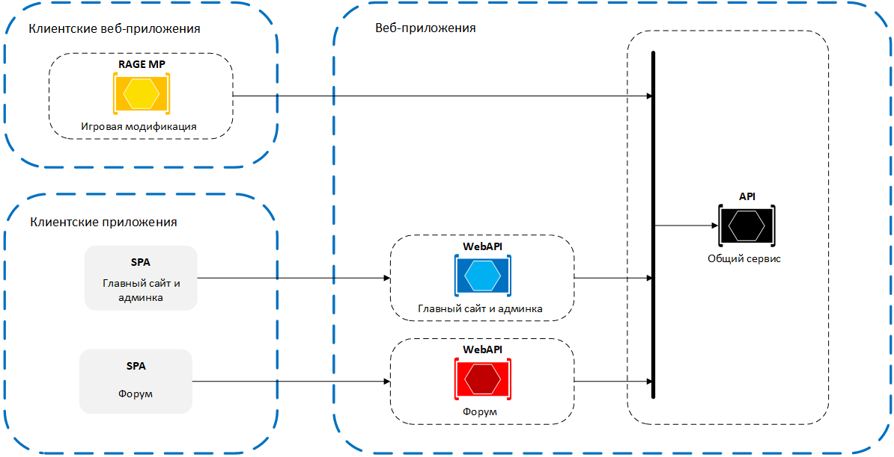

# Архитектура приложения

Проект включает в себя несколько веб-приложений:
- [WebAPI](https://github.com/KShaddix/county-rp/tree/master/src/CountyRP.WebAPI)
- [WebSite](https://github.com/KShaddix/county-rp/tree/master/src/CountyRP.WebSite)
- [Forum](https://github.com/KShaddix/county-rp/tree/master/src/Forum)
- Игровая модификация (в другом репозитории)

Веб-сайт, форум и игровая модификация работают с одними и теми же сущностями, которые находятся в одном и том же хранилище, а также имеют общие операции над этими сущностями. Поэтому выделен общий сервис WebAPI, являющийся источником данных для всех приложений.

## Способ взаимодействия между приложениями

WebAPI поставляет Swagger-спецификацию, на основе которой генерируются клиенты для обращения к WebAPI.
