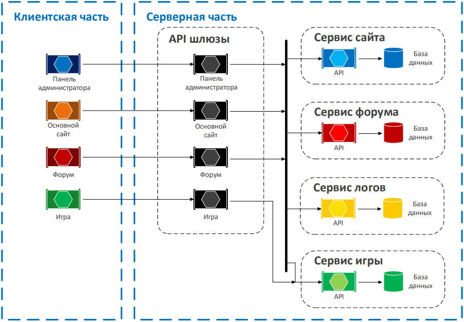

# Архитектура приложения

Проект включает в себя несколько микросервисы, API-шлюзы и клиентские приложения.  
#### Микросервисы:
- [Site](https://github.com/istretyakov/county-rp/tree/dev/src/Services/Site)
- [Game](https://github.com/istretyakov/county-rp/tree/dev/src/Services/Game)
- [Forum](https://github.com/istretyakov/county-rp/tree/dev/src/Services/Forum)
- [Logs](https://github.com/istretyakov/county-rp/tree/dev/src/Services/Logs)
#### API-шлюзы:
- [AdminPanel](https://github.com/istretyakov/county-rp/tree/dev/src/ApiGateways/AdminPanel)
- [GameMode](https://github.com/istretyakov/county-rp/tree/dev/src/ApiGateways/GameMode)
- [Forum](https://github.com/istretyakov/county-rp/tree/dev/src/ApiGateways/Forum)

Веб-приложения, являющиеся BFF, оперируют одними и теми же сущностями, потому общая часть работы с ними выделена в микросервисы.  
Каждый микросервис представляет из себя приложение, хранящее совокупность сущностей и операций над ними, ограниченных определённым контекстом.

## Способ взаимодействия между приложениями

BFF-приложения взаимодействуют с микросервисами посредством клиентов, сгенерированных по Swagger-спецификациям.
